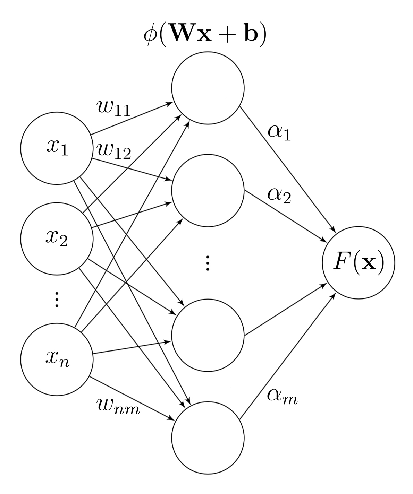

The theory of neural networks revolves around the fact that the neural networks are universal approximators. That it, **for any continuous function  defined on a bounded domain, we can find a neural network that approximates  with an arbitrary degree of accuracy**.

However, it is not widely understood why this holds true. Available literature on the topic tends towards two extremes. On one hand, there are simple visual explanations like the one given by Michael Nielsen [[1]](http://neuralnetworksanddeeplearning.com/chap4.html), with plausible, but not mathematically rigorous arguments. On the other hand, there are scientific papers with lengthy proofs which require a solid mathematical background.

In this note, a simple yet mathematically rigorous explanation is presented. In order to read the text, it will suffice to have basic knowledge of calculus and linear algebra. For the sake of simplicity, some statements will be presented without a proof, in this case an intuitive explanation will be provided. However, an overall argument does not give up on rigour and follows a mathematically elegant as well as historically important proof given by George Cybenko in 1989 [[2]](https://web.eecs.umich.edu/~cscott/smlrg/approx_by_superposition.pdf).

## The Formal Statement
Let us start with defining our neural network and formalizing the theorem statement.

<div align="center">

</div>

<sup>tfefffef</sup>

We consider a feedforward network with  neurons in the input layer,  neurons in the hidden layer, a single neuron in the output layer and some activation function  (e.g., sigmoid or ReLU). We can write it down in a compact way,

<div align="center">

</div>

where , .

The functions $f:\mathbb{R}^n\rightarrow \mathbb{R}$ that our neural network is able to approximate belong to the space of continuous functions on some bounded domain. Let us consider an $n$-dimensional unit cube, $I_n=[0,1]^n$, and denote the space of continuous functions on $I_n$ by $C(I_n)$.

Now we can formally state the **Universal Approximation Theorem**.

**Theorem.** *Consider a neural network of the form (1) where  is sigmoid or ReLU. Then, given any  and 0">, there exists  for which*


<!---
<ul>
  
    <li>
      <a href="{{ post.url }}">{{ post.title }}</a>
    </li>
  
</ul>
-->


### Markdown

Markdown is a lightweight and easy-to-use syntax for styling your writing. It includes conventions for

```markdown
Syntax highlighted code block

# Header 1
## Header 2
### Header 3

- Bulleted
- List

1. Numbered
2. List

**Bold** and _Italic_ and `Code` text

[Link](url) and 
```

For more details see [GitHub Flavored Markdown](https://guides.github.com/features/mastering-markdown/).

### Jekyll Themes

Your Pages site will use the layout and styles from the Jekyll theme you have selected in your [repository settings](https://github.com/olgagraf/olgagraf.github.io/settings). The name of this theme is saved in the Jekyll `_config.yml` configuration file.

### Support or Contact

Having trouble with Pages? Check out our [documentation](https://docs.github.com/categories/github-pages-basics/) or [contact support](https://github.com/contact) and we’ll help you sort it out.
